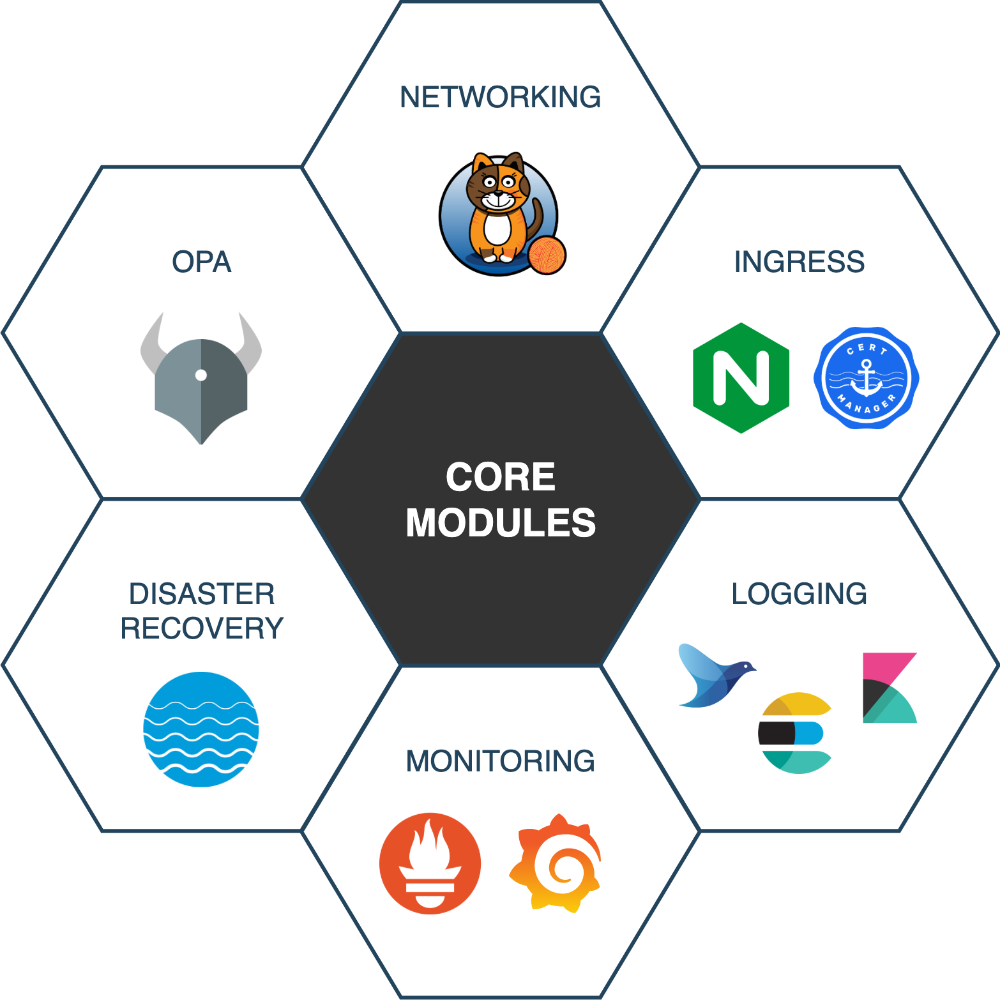

<h1 align="center">
   
  Kubernetes Fury Distribution
</h1>

Kubernetes Fury Distribution (KFD) is a certified battle-tested Kubernetes distribution based purely on upstream Kubernetes.

## Overview

## Architecture

Kubernetes Fury Distribution was designed as a modular Kubernetes distribution.
This modular design makes it possible to extend the distribution with new features.

### Core Modules

The core modules provides essential functionality to the distribution.

  

| Module            	| Description                                                                               	| Latest Release                                                              	|
|-------------------	|-------------------------------------------------------------------------------------------	|-----------------------------------------------------------------------------	|
| Networking        	| Install Calico CNI plugin to implement basic networking functionality                     	|  	|
| Ingress           	| Fast and reliable Ingress Controller and TLS certificate management                       	|     	|
| Logging           	| A centralized logging solution based on the EFK stack (Elastic + Fluentd + Kibana)        	|     	|
| Monitoring        	| Monitoring and alerting functionality based on Prometheus, AlertManager and Grafana       	|  	|
| Disaster Recovery 	| Backup and disaster recovery solution using Velero                                        	|          	|
| OPA               	| Policy and Governance for your cluster using OPA Gatekeeper and Gatekeeper Policy Manager 	|         	|

### Addons Modules

## License

KFD is open-source software and it's released under the following [LICENSE](LICENSE)
